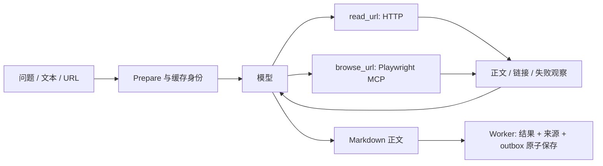

# 设计说明

[返回 README](../README.md)

## 职责

Kagari 使用 Eino TypedChatModelAgent 的模型—工具—模型循环。Typed 约束 Go 消息协议，最终回答是 Markdown；工具参数仍使用 JSON Schema。CLI 与 Telegram 共用 Worker，SQLite 保存任务、正文、来源、读取记录、冻结的周报材料和 outbox。

| 模块 | 负责 |
| --- | --- |
| agent | 问题与偏好输入、提示词、阅读会话、工具循环与模型用量 |
| reader | HTTP、X oEmbed、正文/链接提取、DNS 固定 IP 校验、浏览器网络代理 |
| browser | 每任务 Playwright MCP 连接、页面导航和可见内容快照 |
| digest | 时间范围、材料去重、冻结输入、周报正文回放 |
| store | schema、事务、队列、owner 范围的归档、缓存和 outbox |
| app / distribution / telegram | 业务调用、权限、重试、调度、目标投递与消息接入 |
| render | 正文显示与 UTF-16 消息分段 |

## 阅读调用链

不在模型调用前抓取全部入口，不因单次 HTTP 失败结束分析。模型可选择合法 HTTP(S) URL；只有实际工具返回的正文才算读取依据。没有 URL 的问题也可提交。read_url 通过 HTTP GET 获取页面并提取正文与链接；启用浏览器后，browse_url 同时提供渲染页面读取。模型可直接选择任一工具或混用两者，HTTP 返回成功但正文不足时也可改用浏览器。用户问题、备注与 profile 指导任务；网页、转发材料与工具输出不能改变任务权限。

每个会话按 `(URL, backend)` 保存观察与尝试次数，同 URL 可改用另一后端。失败、缓存命中和后端切换均消耗页面预算；重复工具调用复用本次观察。迭代数与任务时限控制完整循环。程序记录实际 Source、Reading、Usage 和 usage_reported，不要求模型填写固定分类、栏目字段、claim ID 或最终 JSON。

单条分析默认按标题与概述、关键要点、讨论者观点、评价、限制与不确定性、来源组织 Markdown。没有内容的栏目省略，标题随人格和阅读偏好调整；行文结构不限制阅读与补读顺序，也不要求固定字段。

## 浏览器

`browser.enabled` 打开 browse_url。第一次使用时启动固定版本的 Playwright MCP，创建独立无头 Chrome；任务结束关闭 MCP、浏览器、代理和临时目录。浏览器只提供导航与快照读取，不开放执行代码或提交表单。快照是网页可见内容及链接；它不等于网页事实已被证实。

所有页面导航、重定向与子资源经本地代理，沿用 Reader 的公网 IP 检查和固定 IP 拨号。禁用非代理 UDP、QUIC 与 service worker。Playwright 的 allowed-origins 不能作为重定向或 DNS rebinding 的安全边界。显式的 allowed_non_public_cidrs 同时作用于两种读取后端。

独立会话不继承个人 Chrome 或 Codex 浏览器登录态。登录页、付费墙、验证码和不存在的页面仍可能无法取得正文；工具必须保留真实失败或页面观察，不能宣称已经读取目标内容。搜索和交互式展开页面尚未接入。

## 周报与可靠性

当前配置接入 Telegram 多目标，确认、命令回复和处理失败通知只回私聊。任务入队时保存渠道和地址，处理与重试使用该投递目标快照；数据库只使用当前结构，不自动迁移旧表。CLI 分析与周报命令继续只输出本地结果。分发层不依赖 Telegram 客户端，新渠道通过注册正文处理和发送函数接入；目前未实现其他渠道或内容分类路由。

周报按 owner 和收录时间半开区间选择已完成记录，按非空 CacheKey 去重。首次处理冻结正文、来源状态、人格、profile 与截止时间；重试复用同一份材料，来源全文不重复传入模型。模型直接生成 Markdown，默认先写周期总览，再按实际主题分组，分别说明要点、观点与评价、限制和来源，可用简短收尾结束。空栏目省略，不要求固定分类或引用字段；事实与引用质量由提示词及人工评估约束。

空材料不调用模型。输入超过字符上限、模型响应失败/截断或正文为空时失败并保留快照。成功正文先保存，再与任务完成状态和 outbox 原子提交，恢复可以直接回放。

Telegram offset 与入队同事务提交。投递按任务/渠道/地址/分段保持顺序和唯一性；未知发送结果需人工重发。取消保存部分来源并重新排队，本次不计尝试次数；普通失败退避重试，上限包含首次尝试。owner 权限、处理器锁和这些可靠性约束保留。

## 验证

普通测试覆盖真实 Responses 协议往返、工具失败后继续、后端切换、预算、流式/截断/空输出、快照重试、取消保留材料、SQLite 与投递状态。opt-in 的 live_eval_test.go 使用当前模型：答案只存在于最后一页的随机值验证三层追读；另一用例使用真实 HTTP、Chrome 和 MCP 验证模型自主从 HTTP 切换到浏览器取得 JavaScript 内容。它们不承诺任意网站或登录页面都可读取。

## 资料

- [Eino ChatModelAgent](https://www.cloudwego.io/zh/docs/eino/core_modules/eino_adk/agent_implementation/chat_model/)
- [OpenAI 工具调用](https://developers.openai.com/api/docs/guides/function-calling)
- [OpenAI 结构化输出](https://developers.openai.com/api/docs/guides/structured-outputs)
- [Playwright MCP](https://github.com/microsoft/playwright-mcp)
- [官方 MCP Go SDK](https://github.com/modelcontextprotocol/go-sdk)
